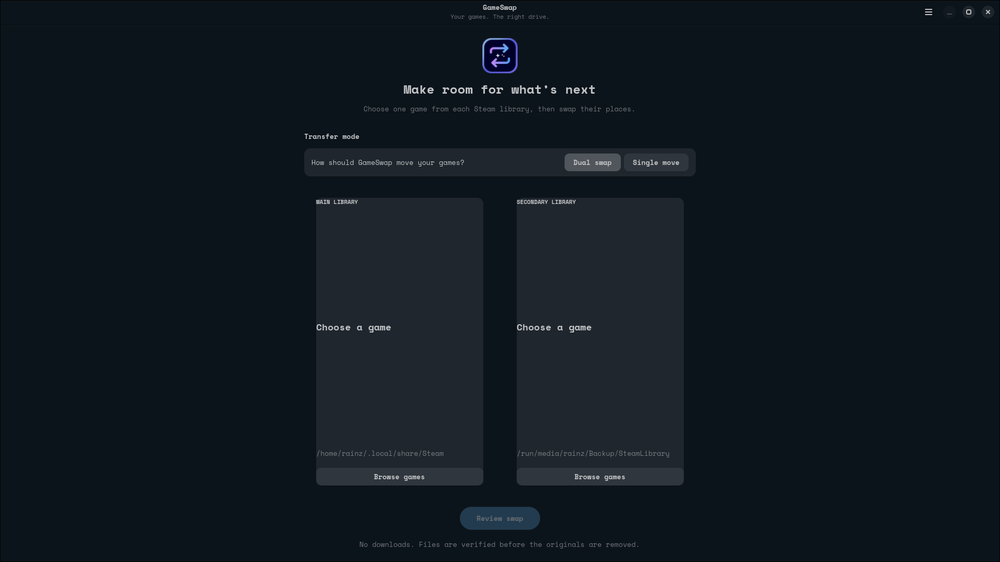

<p align="center">
  <picture>
    <source media="(prefers-color-scheme: dark)" srcset="assets/logo.png">
    
  </picture>
</p>

<h1 align="center">GameSwap</h1>

<p align="center">
  <strong>Move and swap installed Steam games between libraries without downloading them again.</strong>
</p>

<p align="center">
  <em>Two libraries. Any Steam game. No unnecessary redownloads.</em>
</p>

<p align="center">
  
  
  
  
  
</p>

---

## About

GameSwap is a Linux utility for moving and swapping installed Steam games between two Steam libraries without having to redownload them.

It started as **TruckSwap**, a small tool made specifically for switching between Euro Truck Simulator 2 and American Truck Simulator, and was later expanded into a general-purpose Steam library manager capable of working with normal installed Steam games.

The main interface is built with **GTK4 and libadwaita**, while the original terminal interface is still available as an optional fallback.

GameSwap currently supports two transfer modes:

- **Dual swap** — select one game from each library and swap their locations.
- **Single move** — select one game from either library and move it to the other one.

---

## Main UI Preview

<p align="center">
  
</p>

---

## Why?

Steam games can take up a huge amount of storage, and keeping everything on a faster SSD is not always practical.

Moving games manually between Steam libraries also means dealing with installation folders, manifests, Proton prefixes, shader cache data, Workshop files, and making sure Steam still recognizes everything afterward.

GameSwap handles that process for you.

- No unnecessary re-downloading
- No manually moving Steam folders
- No manually editing manifests
- Safe staged transfers
- Verification before removing the original copy
- Recovery support if a transfer is interrupted

---

## Features

- GTK4/libadwaita desktop interface
- Automatic Steam library detection
- Browse installed games from both libraries
- Search games by name or Steam AppID
- **Dual swap mode** for swapping one game from each library
- **Single move mode** for moving one game to the other library
- Handles Steam `appmanifest` files automatically
- Supports Proton `compatdata`
- Supports Steam shader cache data
- Supports Workshop content and manifests when available
- Safe `copy → verify → remove` transfer workflow
- Uses `rsync` for reliable transfers
- Transfer progress and status information
- Pause and resume support
- Interrupted transfer recovery
- Detects unfinished transfers from previous sessions
- Keeps transfer state in:

```text
~/.local/state/gameswap/transfer.json
```

GameSwap tries to avoid leaving either Steam library in a broken state if something interrupts a transfer.

---

## How It Works

GameSwap reads Steam's library configuration and builds a list of installed games in each detected library.

From the main window, you can choose between two transfer modes.

### Dual Swap

Dual swap is the original GameSwap behavior.

You select:

- one game from the main library
- one game from the secondary library

GameSwap then safely swaps both installations between the two storage locations.

### Single Move

Single move lets you select only one game.

GameSwap determines which library currently contains it and moves it to the other configured Steam library.

Before any files are removed, GameSwap creates a transfer plan and stages the files at the destination.

The basic transfer process is:

1. Check both Steam libraries.
2. Verify the selected game or games.
3. Check destination paths and available space.
4. Copy the game to a staging location.
5. Verify the copied data.
6. Publish the transferred files into the Steam library.
7. Move associated manifests and Steam data.
8. Remove the original copy only after verification succeeds.
9. Save recovery information throughout the operation.

If the process is interrupted, GameSwap can detect the saved transfer state and continue from where it stopped.

---

## Interface

The main GameSwap interface includes:

- transfer mode selector
- library overview cards
- searchable game browsers
- game names and Steam AppIDs
- dual swap and single move selection
- transfer review
- progress information
- pause and resume controls
- library configuration
- recovery prompts
- completion and error information

Long-running transfers are handled outside the main UI thread so the GTK interface stays responsive while files are being copied.

Closing GameSwap during an active transfer requests a safe pause instead of immediately killing the operation.

---

## Steam Data

Depending on the game, GameSwap can move more than just the main installation directory.

Supported Steam data includes:

- game installation files
- `appmanifest_*.acf`
- Proton prefixes from `steamapps/compatdata`
- shader cache from `steamapps/shadercache`
- Workshop content
- Workshop manifests

Only data associated with the selected Steam AppID is handled.

---

## Recovery

GameSwap keeps a recovery journal while a transfer is running.

If the application, desktop session, or computer is interrupted, the saved operation can be detected the next time GameSwap starts.

The recovery journal is stored at:

```text
~/.local/state/gameswap/transfer.json
```

The original game is not removed until the required destination files have been copied and verified.

---

## Terminal Interface

The original terminal interface is still included for users who prefer it or need it for troubleshooting.

```bash
gameswap --tui
```

The GTK4/libadwaita interface is the primary GameSwap frontend.

---

## Compatibility

GameSwap is intended for Linux systems using Steam.

It supports normal Steam library layouts as well as additional Steam libraries on other storage devices.

The project currently targets **x86_64 Linux**.

---

## Packages

GameSwap has been prepared for multiple Linux package formats, including:

- Flatpak
- Debian / Ubuntu `.deb`
- Arch Linux / AUR
- RPM-based distributions
- Snap
- standalone x86_64 builds

Release packages are built through GitHub Actions.

Publishing to AUR, Flathub, the Snap Store, and other distribution channels may happen separately from the GitHub release.

---

## Development

GameSwap keeps the transfer engine separate from the graphical interface.

The GTK frontend uses the same transfer planning, validation, verification, recovery, and Steam library logic as the terminal interface rather than maintaining a separate transfer implementation.

This also allows most of the transfer system to be tested without needing to launch the GUI.

---

## Building From Source

Clone the repository:

```bash
git clone https://github.com/devrainz/GameSwap.git
cd GameSwap
```

Run the application:

```bash
python3 gameswap.py
```

Run the terminal interface:

```bash
python3 gameswap.py --tui
```

Run the tests:

```bash
python3 -m unittest discover -s tests -v
```

Further package-specific build and installation instructions are available in the project documentation.

---

## Status

GameSwap is still under active development, but version **2.1.0** is available for public use and testing.

This release marks the move from the original TruckSwap-specific design to a general Steam library manager with a GTK4/libadwaita interface, dual swaps, single-game moves, recovery support, and Linux packaging.

Bug reports and testing feedback are welcome.

More screenshots, package-store releases, and other improvements will be added as they are ready.

---

## License

GameSwap is licensed under the [MIT License](LICENSE).

---

If you encounter any problems or have suggestions, feel free to open an issue or submit a pull request.
